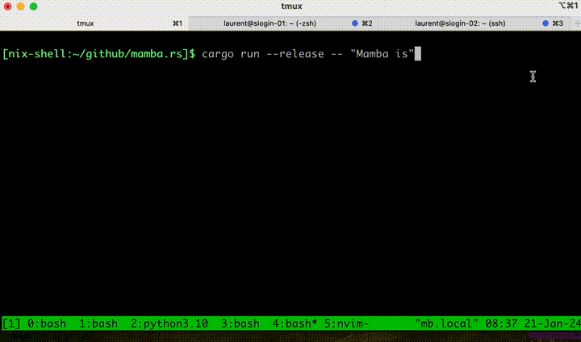

# mamba.rs

Pure Rust implementation of *Mamba* [1] inference with minimal dependencies.
Mamba is an alternative to the transformer architecture. It leverages State
Space Models (SSMs) with the goal of being computationally efficient on long
sequences.

- [1]. [Mamba: Linear-Time Sequence Modeling with Selective State Spaces](https://arxiv.org/abs/2312.00752).

Most of the inspiration for *mamba.rs* (and some of the code) come from
[llama2.rs](https://github.com/srush/llama2.rs) (by @srush).

```bash
# Download the tokenizer config.
wget https://huggingface.co/EleutherAI/gpt-neox-20b/raw/main/tokenizer.json

# Download and generate the weight files.
python get_weights.py

# Run with a prompt.
cargo run --release -- "Mamba is"
```



This uses the [130m mamba model weights](https://huggingface.co/state-spaces/mamba-130m),
this is a really small model so the generated text might not be great.

Alternatively to use the 370m model instead of the 130m one, use the following.
(other variants are `790m`, `1.4b`, and `2.4b`).
```bash
python get_weights.py --which 370m
cargo run --release -- "Mamba is" --which 370m
```

Current features:

- Model weight loading using mmap.
- Matrix multiplication using rayon to leverage multiple cores, but not cache
  friendly.

TODO:

- Improve the efficiency by using SIMD instructions (or `fast-math`) and more parallelism.
- Quantized versions?
